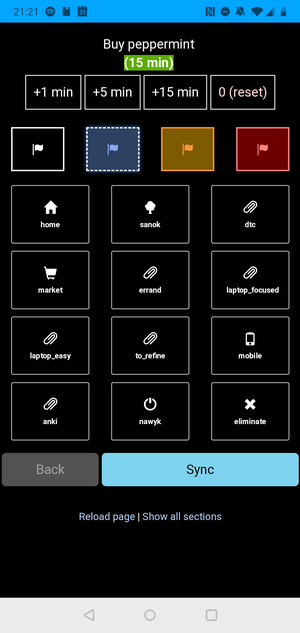

## Todoist Review app

This repository contains a small, home-made web application to help me review queued tasks in [Todoist](http://todoist.com) task manager in a quick, systematic, and linear way (one task at a time).

### Use case

My use case for it is to have a convenient flow to **assign metadata like labels and priority to an ever-quickly growing list of tasks in Todoist inbox**.

Combined with Todoist filters, it allows me to only see tasks in context where I can do something about them and reduce the noise.

### Key features

Currently, the _Todoist Review_ app allows:

- editing (refining) the task title
- assigning a label to a task
- changing task priority
- adding estimated task duration

### Screenshot

## Tech stack

Technically, the app is using the following simple tech stack:

* .NET 8 and ASP.NET (app is based on the MVC template),
* Knockout.js and therefore jQuery,
* Bootstrap for styles

It's set up to compile with one click in the most recent stable versions of Visual Studio Community IDE. It uses [Todoist API](https://developer.todoist.com/) to contact with the platform.

