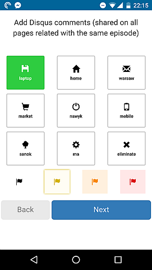

## What is this app?

This repository contains small, home-made web application to help review queued tasks in [Todoist task manager](http://todoist.com) in a quick, systematic way.

I believe that reviewing task is a [crucial part of GTD process](http://gettingthingsdone.com/wp-content/uploads/2014/10/Weekly_review1.pdf) that helps maintain clear view of what needs to be done. Currently this app only allows to assign a label to a task (which I use as a "context" for a task). Perhaps I will add the option to also set priority for tasks in the same view.  

Technically, the app is using ASP.NET MVC, Knockout.js, Bootstrap, JSON.NET, RestSharp, jQuery and it's configured for Visual Studio 2015 Community IDE. It uses [Todoist API](https://developer.todoist.com/) to contact with the platform.

## Screenshot

## Changelog

### Version 2017-10-29
#### Added
* web app manifest for better mobile experience
* ability to eliminate task during review
* alow set priority
* R# team-shared settings file

#### Updated
* improved API mock
* target framework from 4.5.2 to 4.7.1
* external dependencies
#### Removed
* unused Modernizr dependency
#### Fixed

### Version 2016-01-01
#### Added
* Proof of concept
